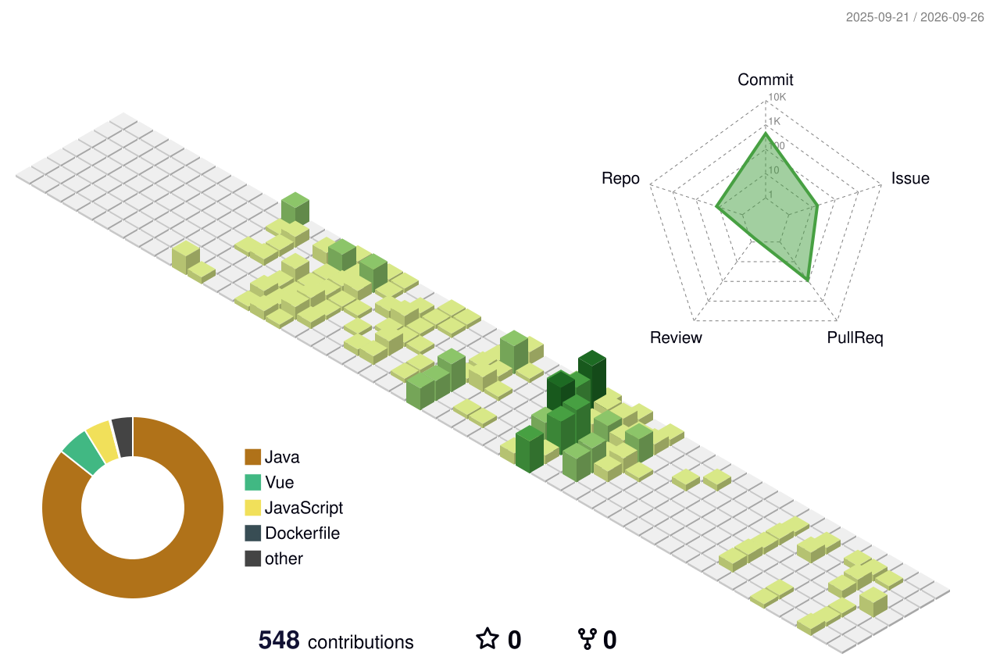

# 안녕하세요, 백엔드 개발자 권민석입니다 

**Java · Spring** | **Spring Batch · Spring Security**

---
About Me

---

Projects

---

## 🛠 Tech Stack

**Language**

**DB**

**Framework**

**Infra**

**Monitoring**

**Collaboration**

---

Certifications
- 정보처리기사
- sqld

---
## 🏆 Career & Projects
[2023]
- 2023.12 ~ 2024.05 메가스터디 IT 백엔드 부트캠프

[2025]
- 2025.02 가천대학교 제 3회 와글와글 해커톤 백엔드 담당
- 2025.04 정보처리 기사
- 2025.06 SQLD

[2026]
- 가천대학교 소프트웨어학과 졸업 (전공 학점 3.85)
- 2025.12 ~ 2026.06 한화시스템 BEYOND SW 캠프 백엔드 교육과정 수료
---

